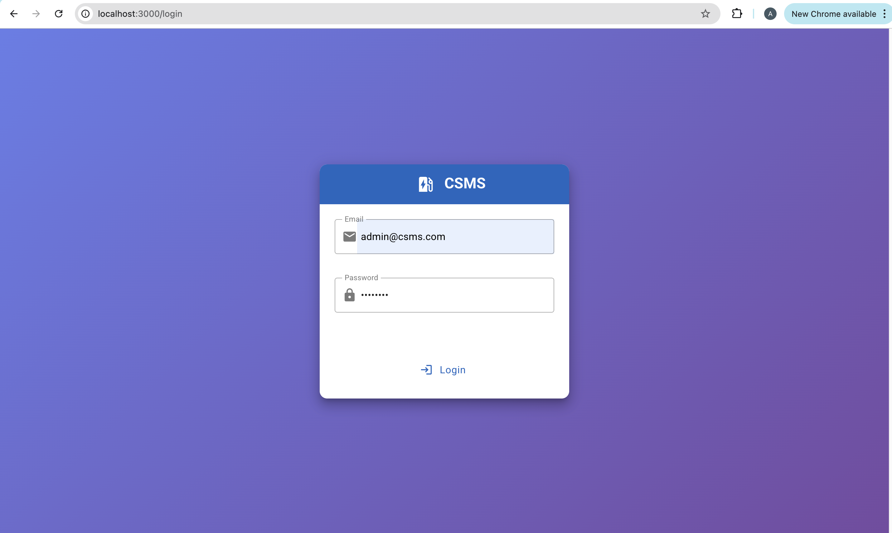
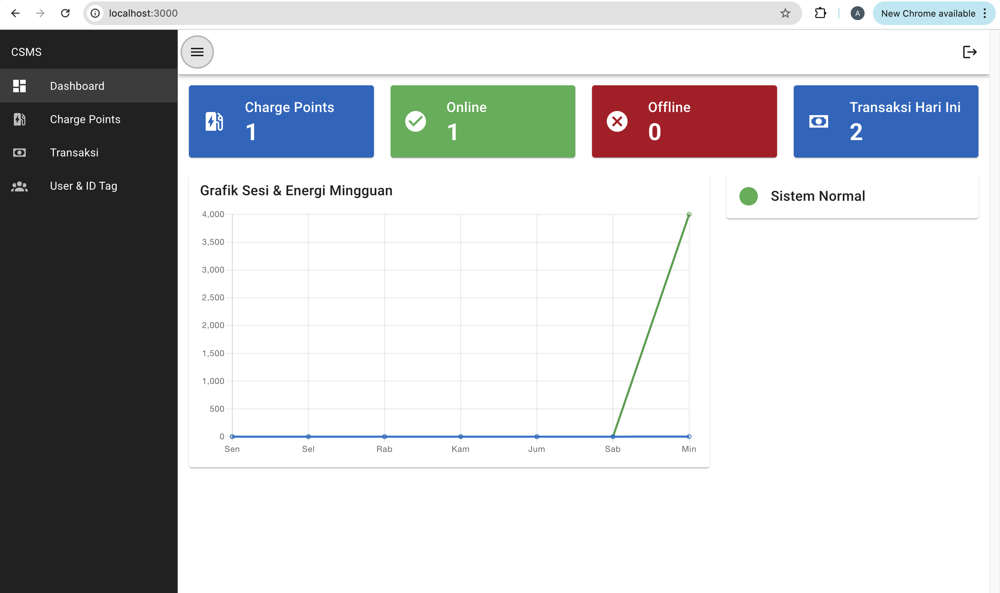
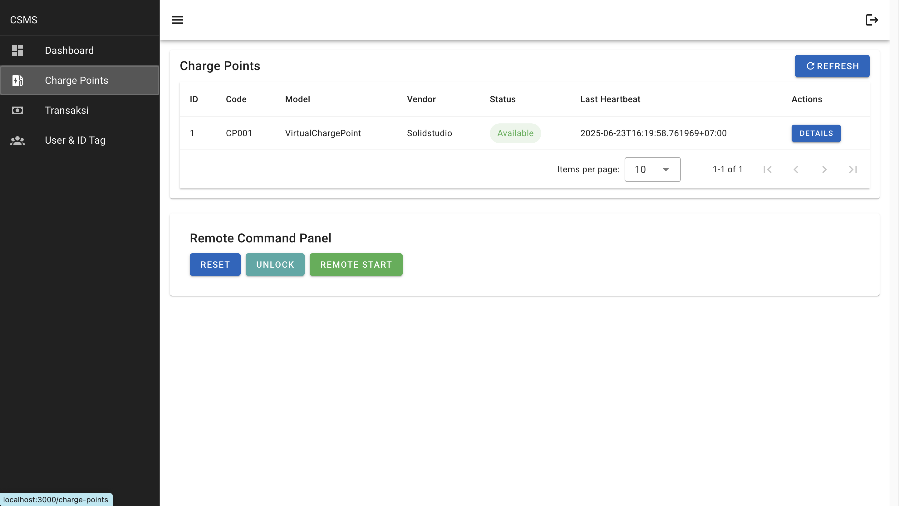
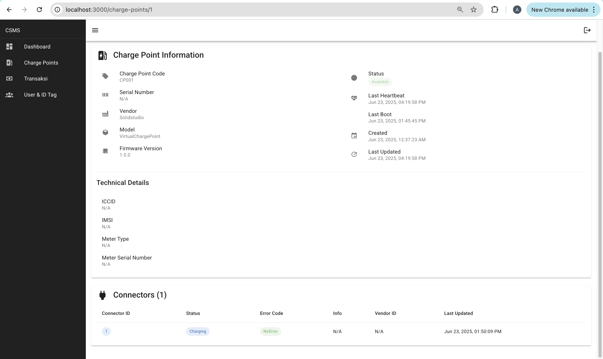
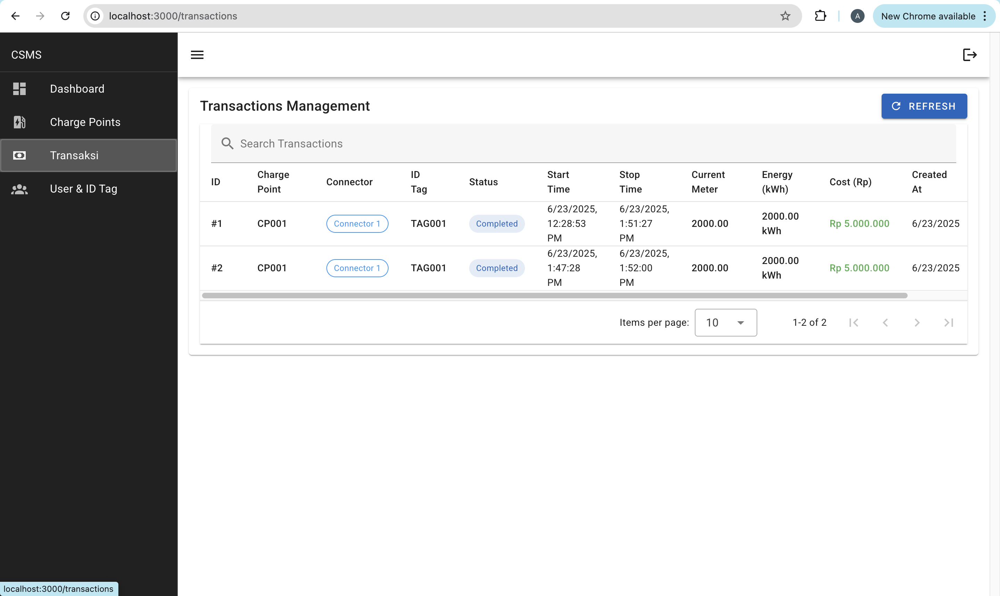
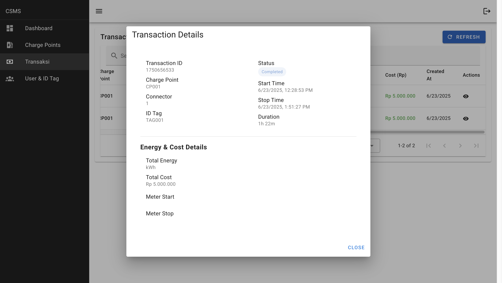
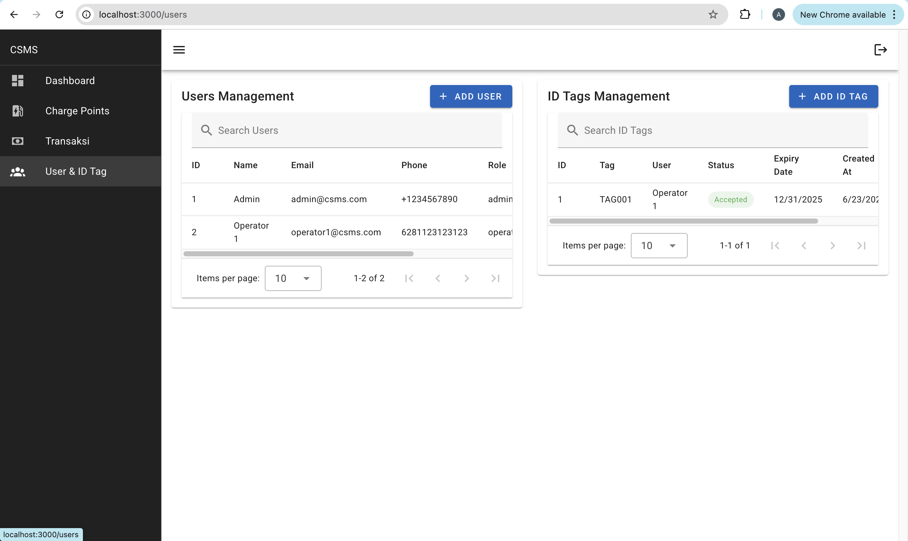

# CSMS APP

An integrated Charging Station Management System (CSMS) consisting of a Go backend and a Vue 3 dashboard frontend.

---

## 📦 Project Structure

- `csms/` — [Go Backend (CSMS)](csms/README.md)
- `csms-dashboard/` — [Dashboard Frontend (Vue 3)](csms-dashboard/README.md)

---

## 🗂️ Brief Description

- **Backend (csms/):**
  - API & OCPP 1.6 WebSocket for station, transaction, user, and RFID management.
  - Clean Architecture, JWT Auth, PostgreSQL, monitoring, etc.
  - [See backend implementation details »](csms/README.md)

- **Frontend (csms-dashboard/):**
  - Real-time monitoring dashboard, user, transaction, and charge point management.
  - Vue 3, Vite, Vuetify, Pinia, JWT Auth.
  - [See frontend implementation details »](csms-dashboard/README.md)

---

## 🖼️ Application Screenshots

> **Login**
> 
>
> **Dashboard**
> 
>
> **Charge Points**
> 
>
> **Charge Point Detail**
> 
>
> **Transactions**
> 
>
> **Transaction Detail**
> 
>
> **Users**
> 

---

## 🎬 Demo App

> [Demo Video](https://drive.google.com/file/d/16nvOqX662dGbfDbYV7RvxoGLH7yHirrP/view?usp=sharing)

---

## 📄 License

MIT License